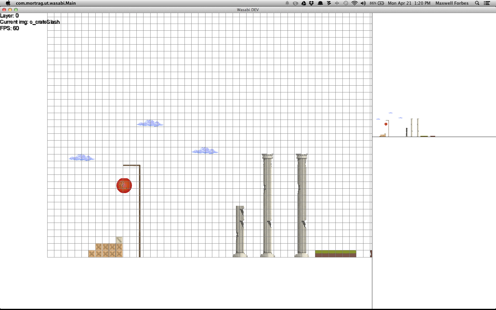

# Wasabi
An unfinished game made using libGDX and Java.

## Screens

_The editor view. Objects can be placed in different layers with different properties (e.g. colliding), with optional snap-to-grid functionality (customizable grid sizes). The minimap is shown in the top right. At compile time, images are are loaded into sprite sheets, converted to textures, and split up for editor use._

_The editor, zoomed-in. This shows pixel-perfect placement capabilities. Levels are saved/loaded through Kryo (serializiation). Press 'p' to show the pause screen, which reveleals all commands._ 

_The same level shown in the editor, this time in 'play' mode. Debug info is shown in the top left, and bounding boxes are drawn on all collidable objects (the player [green] and enemy [blue]). Basic physics are included: gravity, movement from input, basic NPC movement, and collisions with level boundaries / collidable terrain / enemies._

Note that no art assets shown are included in this repository; they are property of a separate artist. (The code itself is available under the MIT license.)

## About
This project was written as a test game from 'scratch' off of libGDX in Java. Development continued for roughly three months until it was halted indefinitely; it's no longer being worked on.

The inklinkgs of a rudimentary game engine were emerging, with the principal features being an interactive point-and-click level editor, with a single button-press to start playing the level. See the features log for more detailed info about what was implemented.

All art assets were tracked separately, and were not my work and so are not included in this project. The code is all mine, however, and is free to use. It shouldn't be difficult to see where you need to put art assets; just change the `textureInputDir` in Main (wasabi-desktop/src/com/mortrag/ut/wasabi/Main.java) to point to where your images are, or pass the directory as the first command line argument, and it will automatically use libGDX's texture packer to pack them into sprite sheets, then load them into the level editor for use.

As of writing (18 April, 2014) there were significant changes made in the characterLayer branch, which was to eventually be merged into master. This might be a good place to start if you want to use the code.

## Features

### 11/30/2013
* Implement level saving / loading
* Smart save/load (no prompt if working on same file, prompt if changes, reset settings on load)

### 11/16/2013
* Change default screen resolution window to 1024 x 768
* Change snap-to-grid size to 50
* Complete rewrite of level editor object mechanics; now: always maps, layers, objects
* Implement collision / non-collision layers; bounding boxes now rendered only for collision layers
* Implement bounding box rendering in level editor (B)

### 11/10/2013
* Fix animation mapping bug (refactored movemet 'intent' to differentiate from user input and behavior 'force', while keeping mechanic the same).
* As a practical consequence, the guard can now march.
* Did preliminary multi-floor surface edge catching fix. Fantastically awful bug still there.
* Implemented frame-by-frame updates (F enables/disables, N goes to next frame) by separating physics from rendering into update() and render() methods. This helped with discovering details of aforementioned bug.
* Fixed floor edge-catching bug.

### 11/09/2013
* Fix animation-specific bounding boxes for characters (correct fit)
* Fix right-side bounding box collisions (animation change)
* Heavily refactored Hero code into abstract WasabiCharacter class; added Renderable interface; added abstract Enemy class and ArmorEnemy.
* Implement simple enemy movement AI (pace)

### 11/08/2013
* Draw bounding boxes (B toggles view)
* Fix 'smart' object rendering (full map now OK; objects now only render smartly)
* Fix whitespace for non-animated sprites (keep whitespace removed)
* Implement animation-specific bounding boxes for characters (bugs?)

### 10/29/2013
* Fixed lurching (actually looks strange now without head-bobbing...)

### 09/30/2013
* Resized hero's bounding box to be slightly more accurate.

### 09/29/2013
* Implemented basic, buggy all-object collision detection
* Implemented basic camera movement during level

### 09/28/2013
* Added debug count of objects drawn
* Added hero debug info (position, velocity, acceleration, on ground?)
* Implemented level-border collision detection
* Added generic Advect-able, Physics-able, Input-able, and Collide-able interfaces.
* Implemented hero movement logic for the above four interfaces.
* Implemented basic physics (gravity, movement accelerations, collisions, friction)
* Added left-facing animation rendering.
* Cleaned up some leftover files (mainly orthographic camera demo + map)

### 09/21/2013
* Actually fixed whitespace. Mostly.
* Updated libGDX to latest nightly (includes maps objects)
* Implemented Screen-switching and added switch-to-test-chamber functionality (X)
* Added map saving (map + layers + objects)
* Implemented barebones test chamber (loads maps, renders)
* Added basic hero with animation map for actions, basic movement

### 09/20/2013
* Rewrote input management again; supports control and/or shift modifiers for keys and scrolling.
* Added toogle grid lines (G)
* Added snap-to-grid functionality (T)
* Changed keyboard based active sprite movement to "press" rather than "press-and-hold"; also changed to 1px adjustments for pixel-perfect nudging
* Implemented mouse functionality (move to move current sprite, click to place it)
* Note that the mouse also behavs according to the snap-to-grid setting (T). So, zoom in and turn off snap-to-grid for pixel perfect adjustments with your mouse!
* Fixed the motherfucking whitespace finally jesus christ god damn.

### 09/19/2013
* Rewrote input management to support key and action descriptions, PRESS/HOLD keys, additional layers of (possibly useless) abstraction (check/display key mappings, ...)
* Fixed drawing order of sprites (currently selected sprite now drawn on top)
* Implemented pausing (P)
* Implemented controls listing on pause screen
* Implemented resizing (IT'S SO FLEXIBLE)
* Texture packer now only runs if textures have been modified: much faster load time (no cleanup though)
* Implemented FPS display
* Fixing some of the bugs I introduced while making shitty versions of the above

### 09/18/2013
* Wrote `level editor' base with main map and mini map
* WSAD moves camera; QE zoom
* Arrow keys move sprite; n cycles sprite
* Space places sprite
* Loads textures in passed directory or `../0_graphics` if none provided, packs in atlas, cleans up when done
